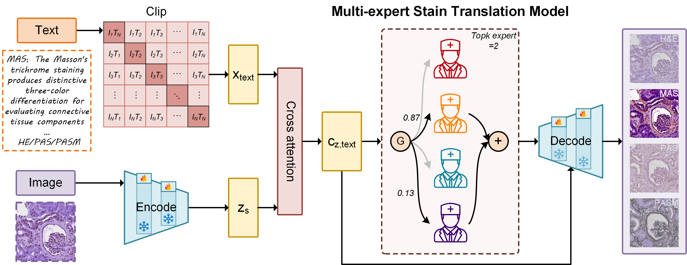

# StainExpert
<div align="center">
**StainExpert: A Unified Multi-Expert Diffusion Framework for Multi-Target Pathological Stain Translation**<br/>

[Zeyu Liu](https://github.com/Rowerliu) et al.<br/>
[GitHub](https://github.com/Rowerliu/StainExpert#)


</div>


## 📇 Overview
Pathological examination is critical for disease diagnosis, with various staining techniques providing detailed visualization of tissue structures. 
While hematoxylin and eosin (H&E) staining remains predominant, the special stains, immunohistochemistry (IHC) and multiplex immunofluorescence (mpIF) provide valuable complementary information for comprehensive diagnosis.
However, current multi-stain workflows are time-consuming, labor-intensive, and tissue-exhaustive, requiring either re-staining or additional tissue sectioning. 
To address these challenges, we propose StainExpert, a unified multimodal diffusion framework for source-to-multi-target pathological stain translation. 
Unlike existing approaches that require separate models for each staining pair, StainExpert establishes the first multi-expert system where specialized networks collaboratively learn staining principles while maintaining domain-specific expertise. 
Through multi-expert and multi-objective optimization, it enables efficient translation from a single source to multiple targets. 
Additionally, our multimodal diffusion architecture integrates textual guidance with visual features, achieving superior accuracy and pathology-informed translation. 
Leveraging parameter-efficient design and model distillation, StainExpert matches GAN-level efficiency while delivering superior generation quality. 
We validate StainExpert across three datasets spanning H&E, special stains, IHC, and mpIF modalities. 
Extensive evaluation demonstrates that StainExpert generates high-quality virtual stains that preserve critical pathological features for accurate diagnosis. 
Beyond robust cross-domain generalization, StainExpert offers a transformative platform for efficient multi-target stain translation, advancing toward streamlined, tissue-conserving, and resource-efficient diagnostic workflows in computational pathology.


## 🗄️ Enviroments
1. Install `torch>=2.1.0`.
2. Install other packages following `requirements.txt`.


## 🗃️ Usage
### 1. Prepare the data (e.g. ANHIR-kidney)

    assume the multi-stain dataset is in `/path/to/anhir-kidney`. It should be like this:

    ```
    path/to/anhir-kidney/:
        train/:
            HE/: 
                HE_images_1.JPEG ...
                HE_images_2.JPEG ...
            MAS/:
                MAS_images_2.JPEG ...
                MAS_images_2.JPEG ...
            ... 

        val/:
            HE/: 
                HE_images_1.JPEG ...
            MAS/: 
                MAS_images_1.JPEG ...
            ...

        test/:
            HE/: 
                HE_images_1.JPEG ...
            MAS/: 
                MAS_images_1.JPEG ...
            ...
    ```

### 2. Prepare the asset file

Download the [CLIP](https://huggingface.co/YeungNLP/clip-vit-bert-chinese-1M/tree/main) and [sd-turbo](https://huggingface.co/stabilityai/sd-turbo) into `asset/`.

    ```
    asset/:
        clip/:
            config.json
            preprocessor_config.json
            pytorch_model.bin
            tokenizer.json
            tokenizer_config.json
            ... 

        sd-turbo/:
            scheduler/: 
                scheduler_config.json
            text_encoder/: 
                model.safetensors ...
            tokenizer/:
                vocab.json ...
            ...
    ```

### 3. Train the StainExpert model<br/>
```bash
python train.py
--train_data_path /path/to/anhir-kidney/train
--val_data_path /path/to/anhir-kidney/val
--num_classes 4
--experts 4
--topk 2
--step 100000
```

### 3. Test the StainExpert model<br/>
```bash
python test.py
--test_data_path /path/to/anhir-kidney/test
--experts 4
--topk 2
```

## 🗂️ Materials
The comparison methods are listed here:

|  Model  | Paper                                                                                                                            |                       Code                        |
|:-------:|:---------------------------------------------------------------------------------------------------------------------------------|:-------------------------------------------------:|
| StarGAN | [StarGAN: Unified Generative Adversarial Networks for Multi-Domain Image-to-Image Translation](https://arxiv.org/abs/1711.09020) |    [Github](https://github.com/yunjey/stargan)    |
|  DMIT   | [Multi-mapping Image-to-Image Translation via Learning Disentanglement](https://arxiv.org/abs/1909.07877)                        |   [Github](https://github.com/Xiaoming-Yu/DMIT)   |
|  Tunit  | [Rethinking the Truly Unsupervised Image-to-Image Translation](https://arxiv.org/abs/2006.06500)                                 |    [Github](https://github.com/clovaai/tunit)     |
|  UMDST  | [Unpaired multi-domain stain transfer for kidney histopathological images](https://arxiv.org/html/2412.11106)                                |  [Github](https://github.com/linyiyang98/UMDST)   |
| MTMGAN  | [Unsupervised many-to-many stain translation for histological image augmentation to improve classification accuracy](https://www.sciencedirect.com/science/article/pii/S2153353923000093)                   |       [Reproduce]         |
| MulHiST | [Multiple Histological Staining for Thick Biological Samples via Unsupervised Image-to-Image Translation](https://link.springer.com/chapter/10.1007/978-3-031-43987-2_71)             | [Github](https://github.com/TABLAB-HKUST/MulHiST) |
| GramGAN | [Unsupervised Multi-Domain Progressive Stain Transfer Guided by Style Encoding Dictionary](https://ieeexplore.ieee.org/document/10388060)                                                                                                                                 | [Github](https://github.com/xianchaoguan/GramGAN) |


## 📍 Acknowledgements
This implementation is based on / inspired by:<br/>
[img2img-turbo](https://github.com/GaParmar/img2img-turbo)<br/>
[Adversarial Diffusion Distillation](https://github.com/Stability-AI/generative-models)<br/>


## 🗃️ Reference
<Liu et al. StainExpert: A Unified Multi-Expert Diffusion Framework for Multi-Target Pathological Stain Translation[J], IEEE TMI, 2025>